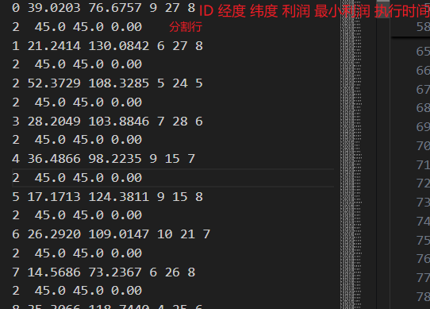

# 一、数据说明

## tasklist.txt

## outputattitude_1.txt:

原始数据：

2013 04 20 22 21 58.827 -38.162 45.000 .000 977192.1 -.0137 -.2460 .0000 -5392.3

分割后的 parts 列表：

索引: 0     1    2    3    4     5        6        7        8        9         10        11        12       13

值: ["2013", "04", "20", "22", "21", "58.827", "-38.162", "45.000", ".000", "977192.1", "-.0137", "-.2460", ".0000", "-5392.3"]

### 处理步骤：

#### 提取第4-6个元素（索引3,4,5）："22", "21", "58.827"
start_h, start_m, start_s = map(float, parts[3:6])  → 22.0, 21.0, 58.827

#### 计算时间戳（秒数），秒数向上取整
start = int(22 * 3600 + 21 * 60 + math.ceil(58.827))  → 79200 + 1260 + 59 = 80519秒

#### 提取第7-8个元素（索引6,7）："-38.162", "45.000"
result = [80519, float(parts[6]), float(parts[7])]   → [80519, -38.162, 45.000]

最终结果：
[80519, -38.162, 45.000]

#### 数据含义：
80519：时间戳（从当天0点开始计算的秒数），对应 22:21:59

-38.162：第一个角度值（可能是俯仰角或方位角）

45.000：第二个角度值（可能是另一个方向的角度）

数据格式推测：

从原始数据看，可能包含：

2013 04 20：年月日

22 21 58.827：时分秒（精确到毫秒）

-38.162 45.000：两个主要的角度数据

后面的数据可能是：其他辅助参数、质量指标、误差值等
